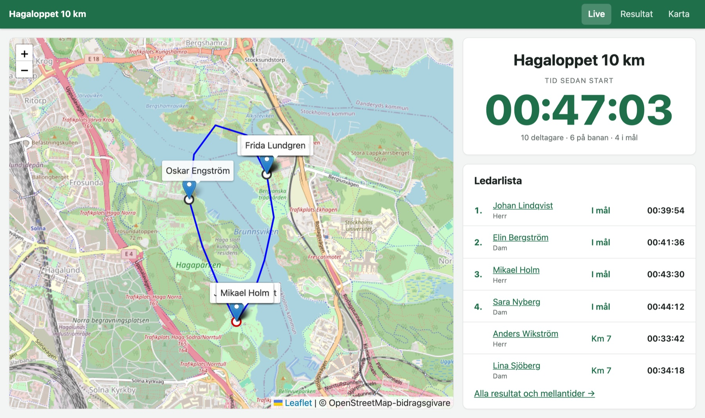
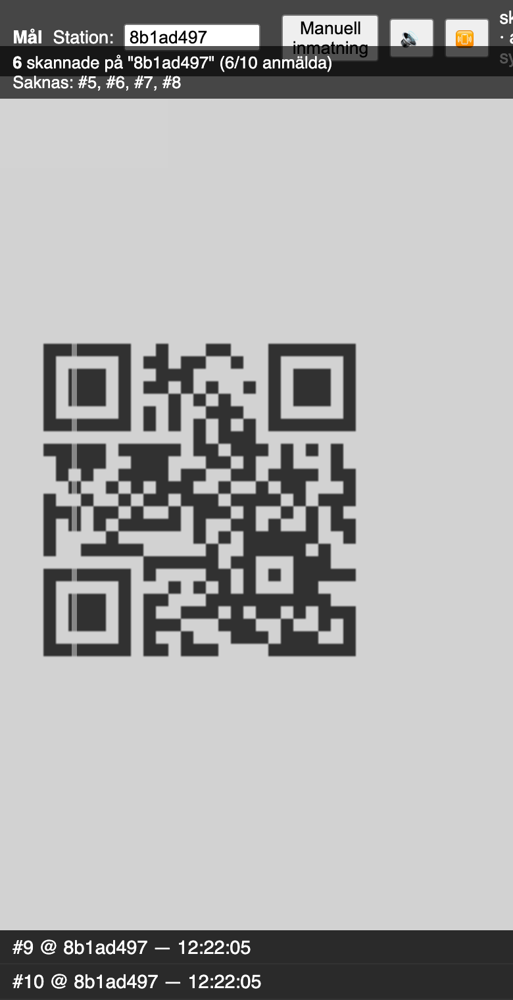
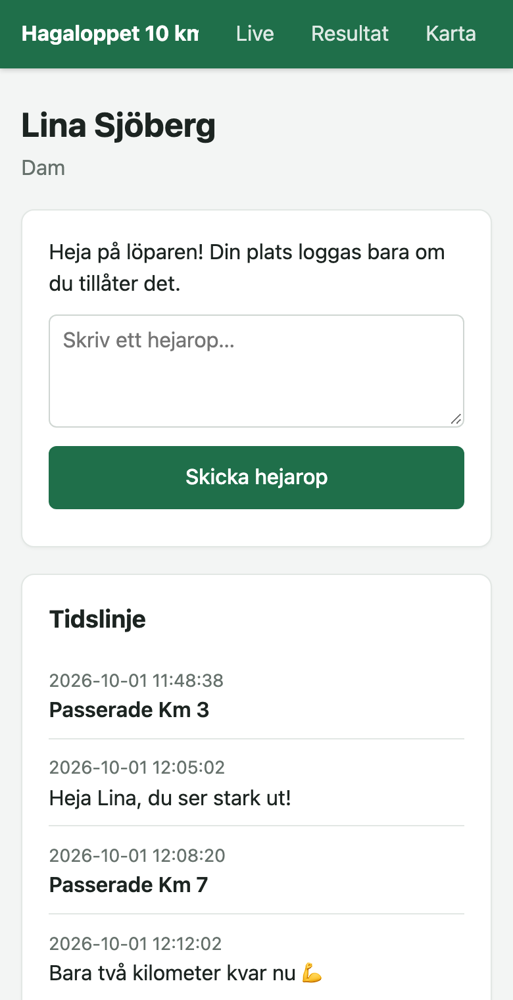
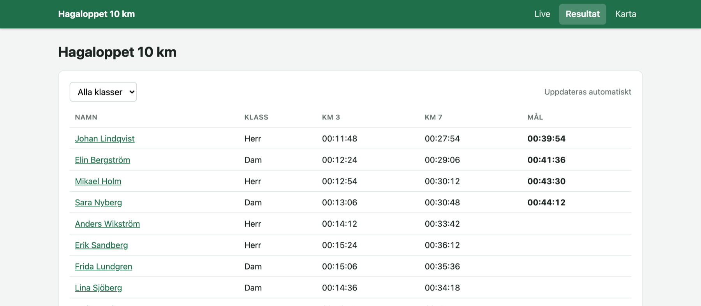
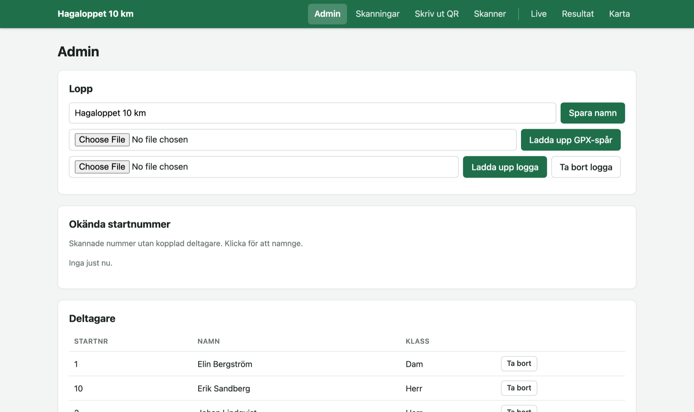

# Tidtagning

[English](README.en.md)

Enkel, webbaserad tidtagning för mindre lopp med gemensam masstart. Funktionärer skannar löparnas QR-nummerlappar med mobilen, publiken följer loppet live på karta och resultatlista, och vem som helst som skannar en nummerlapp kan skicka ett hejarop.

Körs helt på Cloudflare Workers + D1, utan byggsteg och utan frontend-ramverk: vanliga HTML-sidor i `public/` och ett litet Hono-API i `src/index.ts`.

Live: <https://lopp.wwn.se>

## Skärmbilder



| Skannern (funktionär) | Löparsidan (publik) |
|---|---|
|  |  |





## Funktioner

- **Offline-först skanner.** Varje skanning sparas direkt i telefonens IndexedDB med telefonens klocka och synkas till servern när nätet finns. Kamera (BarcodeDetector) eller manuell sifferinmatning. Grön blink och hög ton vid registrerad skanning, låg ton om den redan fanns.
- **Första tiden gäller.** Samma löpare på samma station flera gånger ger bara en tid (PRIMARY KEY + `INSERT OR IGNORE`).
- **Okända nummerlappar.** En okänd QR-kod skannas ändå in och syns i admin som "Okänd #nr" tills den kopplas till en deltagare.
- **Funktionärskort.** Varje funktionär får en QR-länk (`/scan/<token>`) som öppnar skannern låst till rätt station.
- **Live-startsida för TV och mobil.** Karta med GPX-spår och löpare, stor klocka (nedräkning före start, tid sedan start efter), ledarlista.
- **Karta.** GPX-spåret ritas ut tillsammans med stationerna. Varje löpare visas vid sin senast kända position: stationens fasta koordinater vid officiell skanning, annars funktionärens eller gästens GPS.
- **Ledarlista.** Löpare i mål sorteras på måltid. Övriga sorteras på hur långt längs banan de kommit (stationernas *ordning*), sedan på vem som var först dit.
- **Gästrapporter.** Publiken som skannar en nummerlapp hamnar på löparens sida, kan skicka hejarop och (frivilligt) dela sin position. Påverkar aldrig officiella tider.
- **Arkivering.** "Arkivera och nollställ" sparar loppet (resultat, mellantider, karta med GPX och stationer, samt löparsidor med publikens kommentarer) som en fristående HTML-sida på en publik länk och tömmer all tävlingsdata inför nästa lopp.

## Sidor

| Sökväg | Vem | Innehåll |
|---|---|---|
| `/` | Publik | Live: karta, klocka och ledarlista. Gjord för att visas på en TV |
| `/results` | Publik | Fullständig resultatlista med alla mellantider, filter på klass |
| `/map` | Publik | Helskärmskarta |
| `/l/<startnummer>` | Publik | Löparsida: tidslinje och hejarop (dit leder nummerlappens QR-kod) |
| `/admin` | Arrangör | Lopp, GPX, deltagare, stationer (sätts ut på karta), funktionärer, start, arkiv |
| `/admin-scans` | Arrangör | Alla skanningar med vem som skannade och koordinater |
| `/print` | Arrangör | Utskrift av QR-koder för nummerlappar (rutnät eller "Nummerlapp": två per A4 med loppnamn och logga) och funktionärskort |
| `/scanner` | Funktionär | Skannern (installerbar PWA) |
| `/scan/<token>` | Funktionär | Funktionärskortets länk, skickar vidare till en låst skanner |
| `/archive/<id>` | Publik | Arkiverat lopp: karta, resultat och löparsidor med hejarop (`?download` ger filen) |

Admin-API:t (`/api/admin/*`) skyddas med Cloudflare Access (inloggning med t.ex. Google, se nedan) eller, om Access inte är konfigurerat, med Basic Auth och ett gemensamt användarnamn och lösenord (`ADMIN_USER`/`ADMIN_PASS`, används även lokalt och i testerna). Själva admin-sidorna är statiska.

### Inloggning med Cloudflare Access

1. Zero Trust → Settings → Authentication: lägg till en inloggningsmetod (Google, eller One-time PIN som fungerar utan inställningar).
2. Zero Trust → Access → Applications → Add → Self-hosted, med tre destinationer: `lopp.wwn.se/admin`, `lopp.wwn.se/print` och `lopp.wwn.se/api/admin`. (`/admin*` täcker även `/admin-scans`.) Skanner, funktionärskort och publika sidor ska **inte** ligga bakom Access.
3. Lägg till en Allow-policy med arrangörernas e-postadresser.
4. Kopiera applikationens *Application Audience (AUD) Tag* och ditt team-namn och lägg dem i `wrangler.toml`:
   ```toml
   [vars]
   ACCESS_TEAM_DOMAIN = "<team>.cloudflareaccess.com"
   ACCESS_AUD = "<aud-tag>"
   ```
5. `npm run deploy`. Workern verifierar Access-JWT:n på varje admin-anrop, så `workers.dev`-adressen går inte att använda för att kringgå inloggningen. När variablerna finns används inte längre Basic Auth.

## Arbetsflöde på tävlingsdagen

1. **Admin → Lopp:** ange loppets namn, ladda upp banans GPX-fil och (valfritt) en logga. Loggan visas i toppmenyn på alla sidor och följer med i arkivet.
2. **Admin → Stationer:** klicka på kartan där varje station ligger och ange namn, typ (Checkpoint/Mål) och *ordning längs banan* (1 = först). Utan ordning läggs stationen sist. Klicka på en station för att ändra den.
3. **Admin → Deltagare:** lägg in startnummer, namn och klass.
4. **Admin → Funktionärer:** skapa ett kort per funktionär och station.
5. **Skriv ut QR** för nummerlappar och funktionärskort.
6. **Mass-start:** starta nu, om X sekunder eller vid en exakt tid. Nedräkningen visas publikt.
7. Visa `/` på en TV vid målet.
8. Efteråt: **Arkivera och nollställ**.

## Kom igång lokalt

Kräver Node.js 18+.

```sh
npm install
```

Skapa `.dev.vars` (ignoreras av git) med admin-inloggningen:

```
ADMIN_USER=admin
ADMIN_PASS=något-hemligt
```

Skapa den lokala databasen och starta:

```sh
npx wrangler d1 execute tidtagning --local --file=./schema.sql
npm run dev
```

Öppna <http://localhost:8787>.

Kameran i skannern kräver HTTPS, eller `localhost` på samma dator. För att testa med en riktig telefon, deploya eller använd en tunnel.

## Driftsättning

Första gången:

```sh
npx wrangler d1 create tidtagning                  # uppdatera database_id i wrangler.toml
npm run db:init -- --remote                        # skapar tabellerna
npx wrangler secret put ADMIN_USER
npx wrangler secret put ADMIN_PASS
```

Därefter:

```sh
npm run deploy
```

Domänen (`lopp.wwn.se`) konfigureras som custom domain i `wrangler.toml`. Ett lopp per instans: vill man köra flera lopp samtidigt deployar man en instans per (sub)domän med egen D1-databas.

### Schemaändringar

`schema.sql` beskriver hela schemat och skapar bara tabeller som saknas (`CREATE TABLE IF NOT EXISTS`). Nya kolumner på en befintlig databas måste läggas till för hand, både lokalt (`--local`) och i produktion (`--remote`), till exempel:

```sh
npx wrangler d1 execute tidtagning --remote --command "ALTER TABLE stations ADD COLUMN ordning INTEGER"
npx wrangler d1 execute tidtagning --remote --command "ALTER TABLE race_settings ADD COLUMN logo TEXT"
npx wrangler d1 execute tidtagning --remote --command "ALTER TABLE race_settings ADD COLUMN stop_time INTEGER"
```

## Arkitektur

```
public/            statiska sidor (serveras av Workers Assets)
  index.html       live-startsidan
  app.css          gemensam stil
  nav.js           gemensam toppmeny (data-menu="admin" ger adminmenyn)
  livemap.js       delad Leaflet-karta: GPX, stationer, löpare
  scanner.html     skanner-PWA med IndexedDB-kö
  ...
src/index.ts       Hono-API på Cloudflare Workers
schema.sql         D1-schema
```

Kartorna använder Leaflet och leaflet-gpx från unpkg och kartbilder från OpenStreetMap. Inga npm-beroenden i frontend. QR-koderna genereras av Workern själv (`qrcode`, bara kärnan och SVG-renderaren).

### Datamodell (D1)

| Tabell | Innehåll |
|---|---|
| `participants` | `startnummer`, `namn`, `klass` |
| `stations` | `id` (genereras), `namn`, `typ` (`checkpoint`/`mal`), `lat`, `long`, `ordning` |
| `scans` | officiella passeringar: `runner_id`, `station_id`, `timestamp`, `scanned_by`, `lat`, `long`. PK (`runner_id`, `station_id`) |
| `gast_rapporter` | hejarop och positioner från publiken |
| `funktionarer` | `token` → station |
| `race_settings` | en rad: loppnamn, starttid, GPX-spår, logga (data-URL) |
| `archives` | arkiverade lopp: resultat-JSON och fristående HTML |

### Publikt API

| Metod | Sökväg | |
|---|---|---|
| `POST` | `/api/scan` | officiell skanning (från skannern, kräver funktionärskortets token) |
| `POST` | `/api/guest-report` | hejarop och position från publiken |
| `GET` | `/api/results` | alla deltagare med tider per station |
| `GET` | `/api/stations` | stationer sorterade längs banan |
| `GET` | `/api/live-positions` | senast kända position per löpare |
| `GET` | `/api/gpx` | banans GPX-spår |
| `GET` | `/api/race-settings` | loppnamn, starttid och om logga finns |
| `GET` | `/api/logo` | loppets logga (bild) |
| `GET` | `/api/qr?data=…` | QR-kod som SVG (används av utskriftssidan) |
| `GET` | `/api/participant/:id`, `/api/guest-reports/:id` | underlag för löparsidan |

## Kända begränsningar

- `POST /api/scan` kräver ett funktionärskorts token (`Authorization: Bearer <token>`). Token går inte ut med tiden; den gäller tills kortet tas bort i admin eller loppet arkiveras. Skanningar som inte hunnit synkas dessförinnan kan inte skickas in efteråt. Ett kort ger rätt att registrera tider på alla stationer, och skannern utan kort (`/scanner`) kan inte synka.
- Löparnas position på kartan är där de senast skannades, inte en GPS-position i realtid.
- Kravspecifikationen (`kravspecifikation_tidtagningsapp.md`) nämner KV-cache och R2-lagring. Tills vidare räcker D1: GPX-filen och arkiven lagras i databasen, och sidorna hämtar data var 5–10:e sekund.
